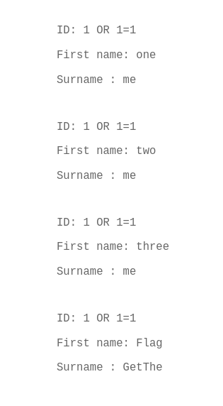

# Explication de l'erreur : Injection SQL dans la barre de recherche d'ID utilisateur

## Description de l'erreur
Une vulnérabilité d'injection SQL a été identifiée dans la barre de recherche d'ID utilisateur. Cette faille permet à un attaquant d'exécuter des requêtes SQL arbitraires en manipulant les entrées utilisateur non sécurisées.

### Comment l'erreur a été découverte
1. **Observation du comportement de l'application** : En saisissant des caractères spéciaux ou des chaînes inhabituelles dans la barre de recherche, des erreurs SQL ont été retournées.
2. **Test avec une charge malveillante** : Une requête comme `' OR '1'='1` a permis d'accéder à des données non autorisées.
3. **Analyse des logs** : Les journaux ont révélé que les entrées utilisateur étaient directement intégrées dans les requêtes SQL sans validation ni échappement.



## Comment éviter cette vulnérabilité
1. **Utiliser des requêtes préparées (requêtes paramétrées)** :
    ```sql
    SELECT * FROM users WHERE id = ?;
    ```
    En utilisant des paramètres, les entrées utilisateur ne sont jamais interprétées comme du code SQL.

2. **Valider et nettoyer les entrées utilisateur** :
    - Vérifiez que l'entrée correspond au format attendu (par exemple, un entier pour un ID utilisateur).
    - Rejetez ou échappez les caractères spéciaux.

3. **Limiter les permissions de la base de données** :
    - Assurez-vous que l'utilisateur de la base de données utilisé par l'application a des permissions minimales.

4. **Utiliser des ORM (Object-Relational Mapping)** :
    - Des outils comme SQLAlchemy ou Doctrine peuvent réduire les risques d'injection SQL en gérant les requêtes de manière sécurisée.

5. **Effectuer des tests de sécurité réguliers** :
    - Intégrez des tests d'intrusion pour détecter les vulnérabilités potentielles.

En suivant ces bonnes pratiques, vous pouvez réduire considérablement les risques d'injection SQL dans votre application.


